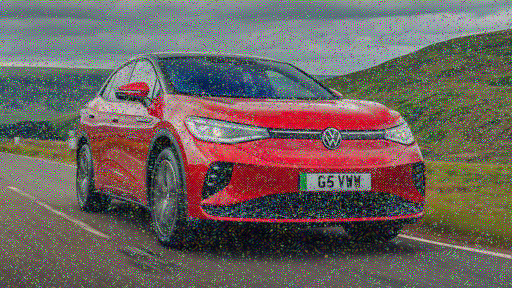
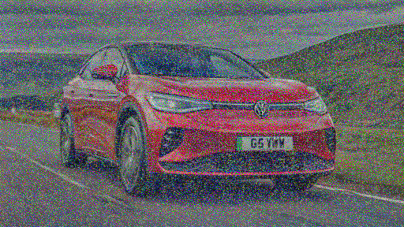
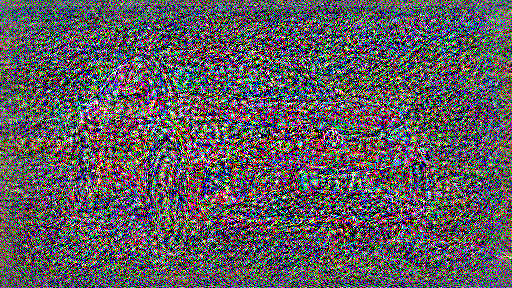
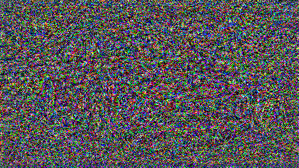
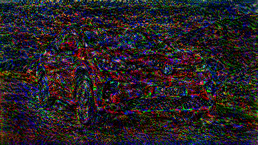

# Neural Style Transfer

Pytorch implementation of Neural Style Transfer (NST). This is mainly a personal project to review all the litterature about NST, implement some of the meaningful ideas and test some personal experiments.

## To-do list

- [ ] Losses

  - [ ] networks
    - [x] VGG16
    - [x] VGG19
    - [ ] ResNet
    - [ ] Inception
  - [x] Total variation loss

- [ ] Image optimization based

  - [x] Simple style transfer
  - [ ] Several styles transfer
  - [ ] Several contents transfer
  - [ ] Several styles and contents transfer

- [ ] Model optimization based

  - [ ] Per style per model
  - [ ] Multi style per model
  - [ ] Arbitrary style per model

## Dataset

For the style dataset, I wanted to have a large pannel of different styles. I chose to take a few paintings from all kinds of art movements: prehistoric, anciant art, medieval, renaissance and impressionism.

As for the content dataset, I wanted to have a large pannel of different content. I chose to take a few pictures from all kinds of categories.

## Results

### Content loss

Surprisingly, the content loss was not easy to optimize alone from a random noise image. The deeper the layer is, the harder it is to optimize. The best results are obtained with the first layer of the network.

|                             conv1_1                             |                             conv2_1                             |                             conv3_1                             |                             conv4_1                             |                             conv5_1                             |                  conv5_1 w/ total variation loss                   |
| :-------------------------------------------------------------: | :-------------------------------------------------------------: | :-------------------------------------------------------------: | :-------------------------------------------------------------: | :-------------------------------------------------------------: | :----------------------------------------------------------------: |
|  |  |  |  |  |  |

## References

- Jing, Y., Yang, Y., Feng, Z., Ye, J., Yu, Y., & Song, M. (2017). Neural Style Transfer: A Review. arXiv. https://doi.org/10.48550/arXiv.1705.04058

- Gatys, L. A., Ecker, A. S., & Bethge, M. (2015). A Neural Algorithm of Artistic Style. arXiv. https://doi.org/10.48550/arXiv.1508.06576
